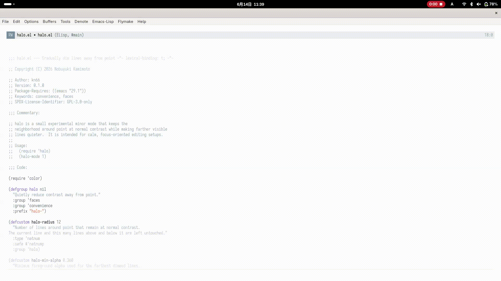
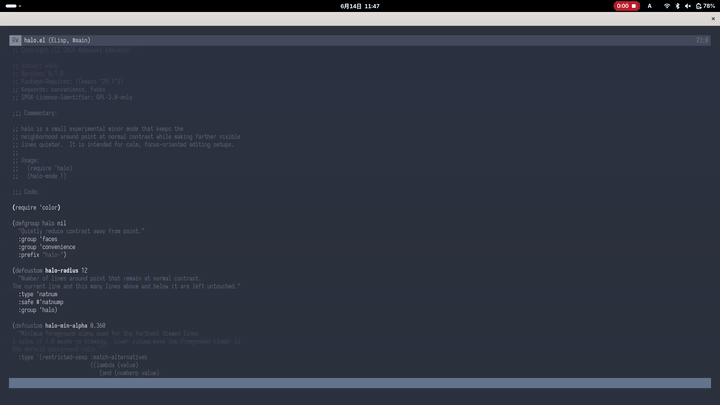

* halo.el

=halo= is a curiosity-driven hobby package and experimental Emacs minor mode
for quiet editing interfaces.  It keeps the central visible window band at
normal contrast, then gradually reduces the contrast of visible lines toward
the top and bottom window edges.

The goal is to reduce eye movement by keeping the cursor near the vertical
center, and to make the center easier to attend to by keeping it at higher
contrast than the surrounding lines.

This may help improve focus, but that is only an informal expectation.

** Demo

#+caption: nano

#+caption: nano-dark

** Requirements

- Emacs 29.1 or later

** Installation

Place this directory somewhere in =load-path=, then load it:

#+begin_src emacs-lisp
  (add-to-list 'load-path "~/.emacs.d/lisp/halo.el")
  (require 'halo)
#+end_src

Enable it in a buffer with:

#+begin_src emacs-lisp
  (halo-mode 1)
#+end_src

Or run:

#+begin_example
M-x halo-mode
#+end_example

Enable it globally with:

#+begin_src emacs-lisp
  (halo-global-mode 1)
#+end_src

Or run:

#+begin_example
M-x halo-global-mode
#+end_example

** use-package

Minimal global setup:

#+begin_src emacs-lisp
  (use-package halo
    :load-path "~/.emacs.d/lisp/halo.el"
    :config
    (halo-global-mode 1))
#+end_src

With explicit settings:

#+begin_src emacs-lisp
  (use-package halo
    :load-path "~/.emacs.d/lisp/halo.el"
    :config
    (halo-global-mode 1)
    :custom
    (halo-focus-band '(0.35 . 0.65))
    (halo-min-alpha 0.360)
    (halo-steps 6)
    (halo-falloff 'smoothstep)
    (halo-idle-delay 0.06)
    (halo-live-update t)
    (halo-center-cursor t)
    (halo-center-fraction 0.5)
    (halo-virtual-top-margin t)
    (halo-global-excluded-modes
     '(minibuffer-mode special-mode comint-mode term-mode vterm-mode eshell-mode))
    (halo-global-exclude-predicate nil))
#+end_src

** Options

- =halo-focus-band=: visible window fraction kept at normal contrast.  The
  default =(0.35 . 0.65)= keeps the central 30 percent unchanged.
- =halo-min-alpha=: minimum foreground alpha for far-away lines.
- =halo-steps=: number of contrast levels.
- =halo-falloff=: contrast curve outside the focus band.  The default
  =smoothstep= keeps the edge of the focus area gentler than linear dimming.
- =halo-idle-delay=: idle delay before overlays are refreshed.
- =halo-live-update=: when non-nil, update overlays immediately after cursor
  movement.
- =halo-center-cursor=: when non-nil, call =recenter= after cursor movement so
  point stays near the vertical center of the selected window.
- =halo-center-fraction=: vertical resting position for point when centering is
  enabled.  =0.5= is the middle of the window; slightly smaller values leave
  more preview context below point.
- =halo-virtual-top-margin=: when non-nil, add display-only space before the
  first buffer line so centering also works at the beginning of the buffer.
- =halo-global-excluded-modes=: major modes where =halo-global-mode= should not
  enable =halo-mode=.  Derived modes are also excluded.  By default this covers
  minibuffers, read-only special buffers, and interactive process or terminal
  modes where automatic recentering can interfere with navigation.  Internal
  buffers whose names start with a space, including child-frame popup buffers,
  are always skipped.
- =halo-global-exclude-predicate=: optional predicate called before
  =halo-global-mode= enables =halo-mode= in a buffer.

=halo-radius= is obsolete.  Existing configurations that still set it are
translated to an equivalent viewport focus band while =halo-focus-band= remains
at its default value.  New configurations should set =halo-focus-band= directly.

Refresh the selected window manually with:

#+begin_example
M-x halo-refresh
#+end_example

Refresh all live windows showing buffers where =halo-mode= is enabled with:

#+begin_example
M-x halo-refresh-all
#+end_example

For an even wider high-contrast area:

#+begin_src emacs-lisp
  (setq halo-focus-band '(0.30 . 0.70))
  (setq halo-min-alpha 0.55)
#+end_src

** Design

This package intentionally starts as a stable MVP.

- It is a buffer-local minor mode.
- =halo-global-mode= enables the buffer-local mode in ordinary buffers and
  skips minibuffers by default.
- It can update immediately after commands, so centering and viewport contrast
  follow fast cursor movement.  Idle refresh remains available when
  =halo-live-update= is nil.
- It only processes the selected window's visible range.
- Contrast is based on displayed line position within the selected window, so
  folded or invisible sections do not make the viewport gradient uneven.
- The default contrast curve is smoothstep rather than linear, so lines just
  outside the focus band do not drop abruptly.
- For folded buffers such as Magit, the visible display lines are scanned once
  per refresh and then reused for viewport-based dimming.
- It caches dimming face specs and applies them to visible text ranges, keeping
  syntax foreground hues softened instead of flattening a dimmed line to one
  color.
- It removes old contrast overlays before every refresh.
- It also removes orphan overlays tagged by this package, so stale dimming does
  not survive reloads or mode re-enabling.
- The configured central focus band is left untouched.
- Optional cursor centering uses Emacs' built-in =recenter=.
- The beginning of the buffer can receive a display-only virtual top margin, so
  the first line can still sit near the vertical center without inserting text.

The dimming face blends each visible text range's foreground color toward the
default background.  This keeps syntax colors recognizable while reducing
contrast toward the top and bottom window edges.

** Known Limitations

- Overlay faces from other packages may not always be reflected in the softened
  foreground color.
- If the same buffer is shown in multiple windows, each halo overlay is scoped
  to the window it was created for.
- Very unusual themes or terminal color setups may produce less smooth dimming.
- The package does not try to dim non-selected windows yet.

** Org and Markdown

For prose-heavy buffers, a slightly wider focus band is often more readable:

#+begin_src emacs-lisp
  (add-hook
   'org-mode-hook
   (lambda ()
     (setq-local halo-focus-band '(0.32 . 0.68))
     (setq-local halo-min-alpha 0.45)
     (setq-local halo-center-cursor t)
     (halo-mode 1)))

  (add-hook
   'markdown-mode-hook
   (lambda ()
     (setq-local halo-focus-band '(0.34 . 0.66))
     (setq-local halo-min-alpha 0.42)
     (setq-local halo-center-cursor t)
     (halo-mode 1)))
#+end_src

** Future Ideas

- A companion mode that dims buffers in non-selected windows.
- Theme-aware color blending that handles more unusual face combinations.
- A child-frame mask backend for GUI-only experiments that dim by covering
  distant screen regions instead of changing text foregrounds.
- Separate profiles for programming, Org, Markdown, and prose editing.

** License

GPLv3
